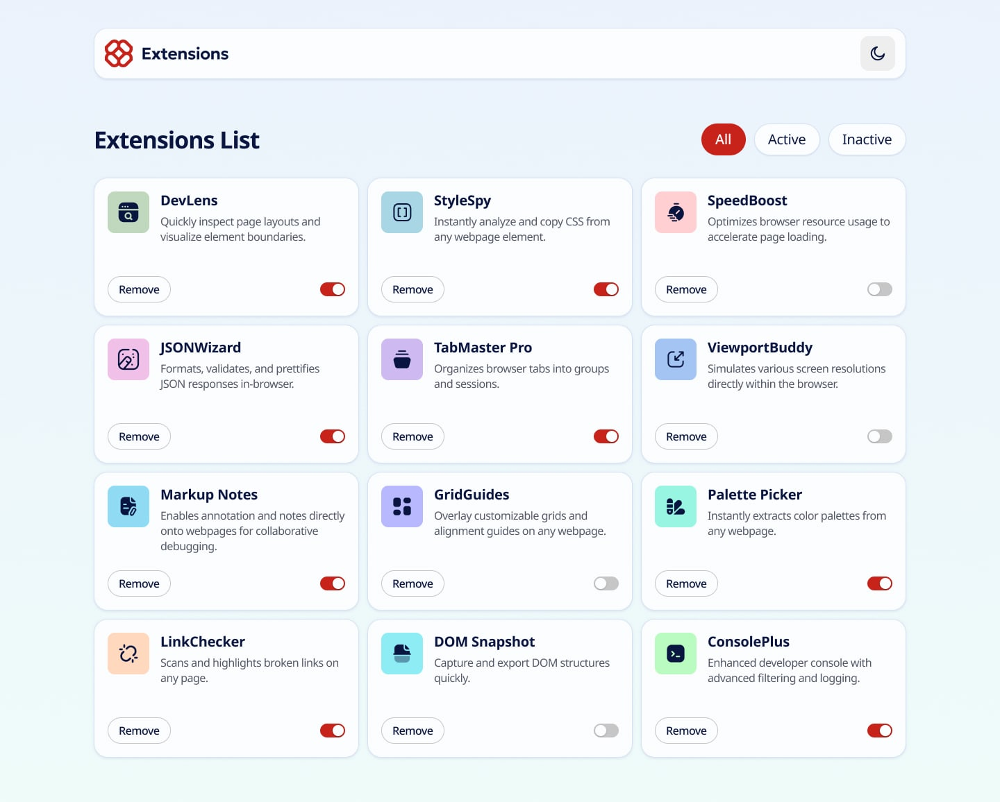

# 📩 Browser extension manager UI

This is a solution to the [Browser extension manager UI](https://www.frontendmentor.io/challenges/browser-extension-manager-ui-yNZnOfsMAp). 

## 📸 Screenshot

## 🌐 Links

### 🚀 Solution
- Solution URL: [here](https://www.frontendmentor.io/solutions/contact-form-main-react-ts-IWREpMXybX)
### 🔗 Live Demo
- Live Site URL: [here](https://contact-form-six-teal.vercel.app/)

## 🛠️ Built With

- [React](https://reactjs.org/)
- 🟦 TypeScript

## 🎯 Key Features

- ✅ Real-time email validation with clear error messages
- 📱 Fully responsive layout (mobile-first approach)
- ✨ Instant feedback with stylish notifications using sonner
- ♿️ Accessible form with proper input labels and aria attributes

## 👨‍💻 Author

- Frontend Mentor - [MoisesAlfar0o](https://www.frontendmentor.io/profile/MoisesAlfar0o)
